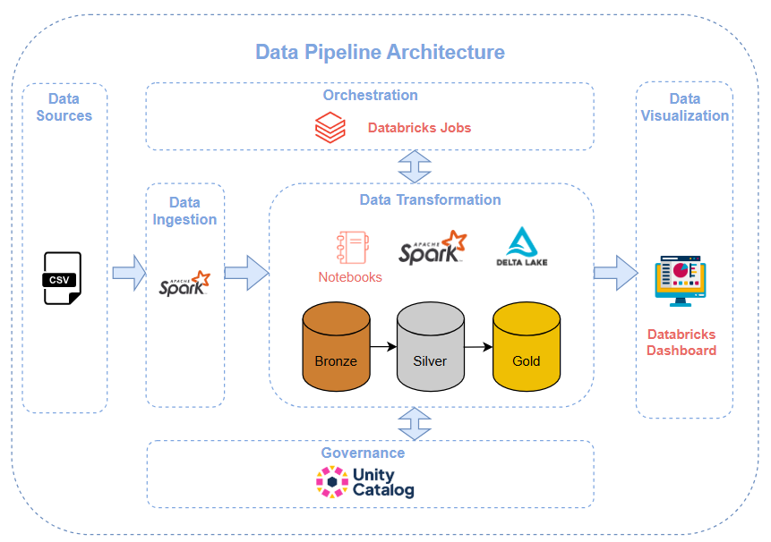

# End-to-End Data Engineering Project (Databricks)

## Project Overview

This is an end-to-end data engineering project in the finance domain built on **Databricks**.

It implements a **metadata-driven pipeline** based on the **Medallion Architecture (Bronze, Silver, Gold)** to process and transform banking data from multiple sources, including CSV files.

The project provides a unified analytics platform with interactive dashboards, enabling business users to explore data and generate insights on:
- Customer activity
- Risk analysis
- Branch performance

---
## Architecture
The project follows the **Medallion Architecture**:

- **Bronze Layer** → Raw data ingestion from multiple sources
- **Silver Layer** → Cleaned and standardized data
- **Gold Layer** → Business-ready datasets for analytics and dashboards
- The pipeline is orchestrated using **Databricks Jobs and notebooks**, which control the execution of each layer , ensuring controlled and traceable workflow execution.

---

## Tech Stack & Tools Covered

### Data Ingestion
- Autoloader  
- PySpark  
---
### Transformation
- Apache Spark  
- Spark SQL  
- Delta Lake  
- Databricks Notebooks  
---
### Orchestration
- Databricks Workflows / Jobs  
---
### Governance
- Unity Catalog  
---
### Data Visualization
- Databricks Dashboards  

---

## Metadata-Driven Framework

This project uses a **metadata-driven architecture** to manage and automate the data pipeline without hardcoding logic.

### Key Metadata Tables

- **metadata.tables**
  - Central registry of all logical tables and their source configurations

- **metadata.table_parameters**
  - Stores ETL configurations (load type, primary keys, watermark columns)

- **metadata.table_watermarks**
  - Tracks incremental load progress to avoid full reloads

- **metadata.pipeline_runs**
  - Logs pipeline executions for monitoring, auditing, and debugging

---

## Key Features

- Metadata-driven ETL pipelines
- Support for multiple data sources (SQL Server, CSV, cloud storage)
- Incremental data processing using watermarks
- Medallion architecture (Bronze / Silver / Gold layers)
- Full pipeline observability and audit logging
- Interactive dashboards for business insights
---

## Benefits

- Scalable and maintainable architecture
- Centralized metadata control
- Full traceability of data pipelines
- Business-friendly analytics layer

